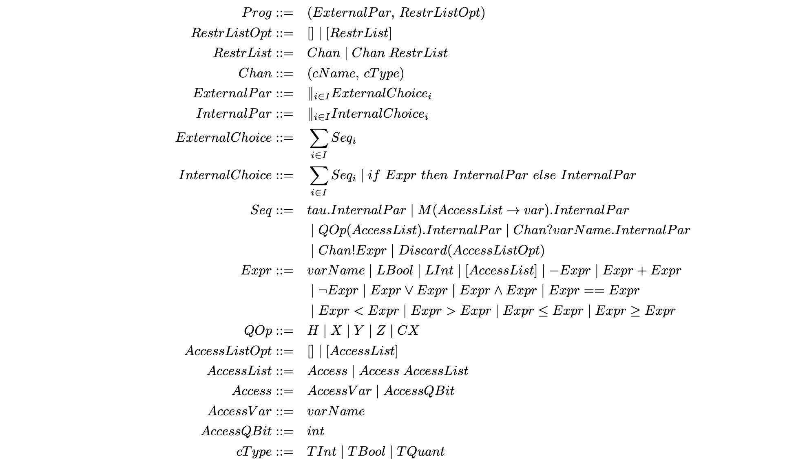

# LQCCS Interpreter

Interpreter for linear quantum CCS.

### Table of contents
* [Grammar](#grammar)
* [Usage](#usage)

## Grammar


## Testing
To test the parser you can see the tests in [test_parser.ml](./test/test_parser.ml) and run them with `make test_parser`.

To test the typecheck you can see the tests in [test_typecheck.ml](./test/test_typecheck.ml) and run them with `make test_tyepcheck`.

## Usage
``` 
  -p Parse and print AST
  -t Type checks and print the result
  -i Interpret the source file
  -o Place the output into file (default: a.out)
  -help  Display this list of options
  --help  Display this list of options
``` 

### Install dependencies

``` 
make deps
```

### Build

``` 
make build
```

### Run

``` 
make start path/to/source/file
```

### How to run and give flags to the program
For example, if you want to give the flag `-p` you can do the following: 

``` 
_build/default/bin/lqccsint.exe -p test/samples/parser/fail-nondeterm1.lq
``` 

### How to run the tests

``` 
./runtests.sh
``` 
